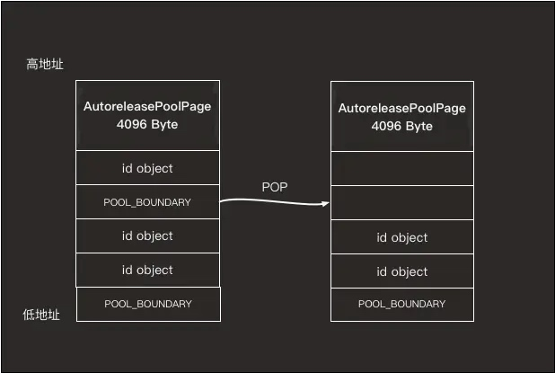

# 腾讯面试题1
[原题地址](https://zhuanlan.zhihu.com/p/379239806)

## 一面
### 常见的属性修饰符有哪些，使用copy应该注意些什么
难度 ⭐️

nonnull, nullable 兼容Swift Optional

assign, weak, strong, copy, retain, unsafe_retain 引用计数相关

atomic, nonatomic 线程安全

readwrite, readonly 读写权限

getter, setter 方法命名

copy的注意点：
1. copy得到是不可变对象，即使你声明的是可变对象
2. copy的时候要区分对象或者集合对象
集合对象是单层深拷贝，这个要注意。
3. 还有一个可能就是block的copy,不过这个是从MRC遗留的做法，现在无论是不是copy,在需要的时候都会copy到堆上


### 深拷贝和浅拷贝区别

难度 ⭐️

深拷贝是 创建新的指针指向新开辟的内存区域
浅拷贝是 新的指针指向原本的内存区域，引用计数+1

拓展: 为什么会有浅拷贝
性能考虑,比如不可变对象,进行不可变拷贝，没有深拷贝的意义

### atomic 真的安全么，加的锁是哪种锁

难度 ⭐️⭐️ 

安全要看从什么角度来看，atomic本质是对getter setter方法加锁，如果单从 getter setter方法这个颗粒度来看的话，就是安全的，但如果上升为修饰的这个对象的话，就是线程不安全的，因为多线程读写同是进行的话，是可能造成意想不到的结果。

早期是自旋锁，后期因为安全性的问题，换成了互斥锁

拓展：自旋锁和互斥锁的区别
自锁锁：如名字一样自己原地旋转，当获取不到操作对象的权限的话，会忙等，循环检查是有拥有权限，效率高，性能差

```
while (抢锁(lock) == 没抢到) {
}
```
互斥锁：
获取不到操作对象的权限的时候，休眠，等待操作系统唤醒解锁
```
while (抢锁(lock) == 没抢到) {
    // 休眠， 等待被唤醒
}
```


### iOS中内存管理是怎么样的 

难度 ⭐️

主流语言的内存管理一般分为2种

1. GC垃圾回收机制
2. Ref引用计数

iOS端采用了引用计数的方式

retain == +1
release == -1

当ref count = 0的时候即释放内存。

当然还有 autoRelease，因为部分对象需要脱离当前上下文使用，需要延迟释放。autoRelase的本质就是把对象加到autoRleasePool当中，autoReleasePool会等到下次Runloop释放当前pool内所有内存。

### 自动释放池原理，本质

autoReleasePool一般分为两块来讲
 
 1. 本身的数据结构
 autoReleasePage双向链表，page种指针栈，
 分为2种指针，一种`POOL_BOUNDARY`的哨兵对象，来判断pop的位置，还有一种就是需要释放的指针对象
 

 
 1. 管理内存的流程
 具体管理内存的流程，就要结果runloop来分析，runloop唤醒的时候会会进行常见page对象进行push操作压入哨兵对象，休眠时候会pop操作释放需要释放的对象。

在objc源码种注释
>   Autorelease pool implementation
> A thread's autorelease pool is a stack of pointers.
   Each pointer is either an object to release, or POOL_BOUNDARY which is
	 an autorelease pool boundary.
   A pool token is a pointer to the POOL_BOUNDARY for that pool. When the pool is popped, every object hotter than the sentinel is released.
   The stack is divided into a doubly-linked list of pages. Pages are added and deleted as necessary.
   Thread-local storage points to the hot page, where newly autoreleased objects are stored.
 

### 常见的内存泄漏有哪些
### block 出现循环引用的原因
### 线程和runloop之间的关系是怎么样的
### GCD 中串行并行队列，同步异步的区别
### 有遇到过死锁么，怎么产生的
### runtime查找方法的过程
### runtime 是怎么实现weak置nil的
### 关联对象是线程安全的么
### isKindOf 和 isMemberOf 区别
### iOS Class结构
### load 和 initialize 区别
### 说一下kvo实现的原理，使用kvo需要注意什么，手动触发应该怎么做
### 有多个分类实现同一个方法，最后会执行哪个
### iOS 产生卡顿的原因，什么是离屏渲染
### 沙盒文件目录
### 说一下从点击屏幕开始到某个按钮触发中响应链传递机制，如果要更改响应范围怎么做
### 常用的锁有哪些，性能怎么样
### xcode从开始编译到app出现第一个界面中之间进行了哪些工作（分成xcode编译成功和app启动讲的）
### 音视频开发的简单流程
### PCM 数据格式是怎么样构成的
### 常见的音频压缩方式，优缺点
### 算法题：链表的反转
### 有什么要问的么？

## 二面
### 项目中哪个功能最能体现自己的技术实力？具体讲一下
### 对mvvm，mvc的理解，项目中怎么体现的
### 有用过多线程技术么，在项目中怎么做的
### iOS 单元测试简单流程
### 查找算法的实现
### 对hash算法了解么，iOS中哪些地方用到了hash算法，hash冲突怎么解决

## 三面
### 项目中哪个功能最能体现自己的技术实力？具体讲一下
### 常见的崩溃有哪些，遇到崩溃问题怎么查找解决，遇到无符号化的崩溃怎么处理
### 数据库读写安全，表结构发生变化，怎么合理更新数据库缓存
### 设计模式有哪些，在项目中怎么体现的
### app性能优化（分别从cpu和gpu优化去讲的）
### 除了oc,有学习别的语言么，一般是怎么学习的
### 为什么离职,离职原因说一下

## 四面
### 为什么离职,为什么不考虑转岗
### 项目中哪个功能最能体现自己的技术实力？具体讲一下
### 选一个功能实现，讲一下实现思路和方案,遇到问题是怎么解决的
### 为什么做iOS， 有看过iOS相关的书籍么
### 讲一下https 数据发送过程
### 看过iOS相关的源码实现么，realizeClass做了哪些， ### class_rw_t和class_ro_t 区别
### 手画一下mvvm结构图，讲一下你的理解
### 不用临时变量交换两个int类型数（加减法，但要注意边界值 溢出问题，有符号 -231～231-1，无符号 0～2^32-1）
### 设计一个缓存机制需要注意哪些点（lru算法，线程读写安全）
### 写一下lru算法（双向链表+hash）
### 有什么要问的么？

## 五面
### http1.1和2.0有什么区别，Keep-Alive模式
### tcp长连接和短连接的区别
### mvvm，mvp，mvc的区别
### 面向对象设计的六大设计原则是什么
### 红黑树有了解么
### 如何用两个栈实现队列功能
### 常见的锁有哪些，实现奇偶数交叉打印